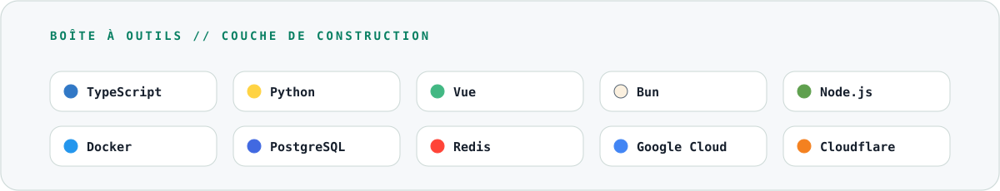
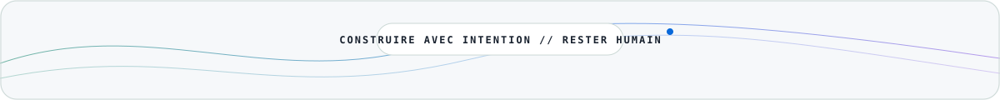

<picture>
  <source media="(prefers-color-scheme: dark)" srcset="./assets/generated/banner-dark.svg">
  <source media="(prefers-color-scheme: light)" srcset="./assets/generated/banner-light.svg">
  
</picture>

<p align="center">
  <a href="https://github.com/Drag0n69?tab=followers"></a>
  <a href="https://github.com/Myxelium-Corp"></a>
  <a href="https://www.youtube.com/@Drag0n69_RSA"></a>
  <a href="https://x.com/JordanZera76441"></a>
  <a href="https://www.facebook.com/jordan.zerathe/"></a>
  <a href="https://orcid.org/0009-0009-5288-2651"></a>
</p>

<p align="center">
  Je construis des systèmes local-first pour les agents IA, les flux de connaissances et le homelab —<br>
  avec l’humain au centre des décisions.
</p>

## Signal actuel

<table>
  <tr>
    <td width="33%" valign="top">
      <h3>🍄 Mycelium</h3>
      Orchestration d’agents, connaissance durable et points de décision humains.
    </td>
    <td width="33%" valign="top">
      <h3>🏠 Homelab</h3>
      Services locaux, automatisation, observabilité et infrastructure maîtrisée.
    </td>
    <td width="33%" valign="top">
      <h3>🧰 Outils de construction</h3>
      Des outils pratiques pour Windows, WSL, les conteneurs et le Web.
    </td>
  </tr>
</table>

## Boîte à outils

<picture>
  <source media="(prefers-color-scheme: dark)" srcset="./assets/generated/stack-dark.svg">
  <source media="(prefers-color-scheme: light)" srcset="./assets/generated/stack-light.svg">
  
</picture>

## Pouls GitHub

<picture>
  <source media="(prefers-color-scheme: dark)" srcset="./assets/generated/metrics-dark.svg">
  <source media="(prefers-color-scheme: light)" srcset="./assets/generated/metrics-light.svg">
  
</picture>

<sub>Les données publiques sont actualisées automatiquement. Aucun nom de dépôt privé ni détail d’activité privée n’est exposé.</sub>

## Projets choisis

- **[Myxelium-Corp](https://github.com/Myxelium-Corp)** — l’espace public consacré à l’orchestration d’agents et aux outils d’IA souverains.
- **[Fusion](https://github.com/Myxelium-Corp/Fusion)** — expérimentations autour de l’orchestration d’agents sur plusieurs nœuds.
- **[CrownCacheAddonWoWAscension](https://github.com/Drag0n69/CrownCacheAddonWowAssension)** — un add-on Lua issu du côté gaming de l’atelier.

> La majeure partie de l’atelier reste privée pendant la consolidation et la documentation des projets.

## Principes de fonctionnement

```text
local-first  ·  systèmes observables  ·  provenance explicite
validation humaine  ·  changements réversibles  ·  automatisation utile
```

<p align="center">
  <a href="https://github.com/Drag0n69">GitHub</a> ·
  <a href="https://github.com/Myxelium-Corp">Myxelium-Corp</a> ·
  <a href="https://www.youtube.com/@Drag0n69_RSA">YouTube</a> ·
  <a href="https://x.com/JordanZera76441">X / Twitter</a> ·
  <a href="https://www.facebook.com/jordan.zerathe/">Facebook</a>
</p>

<picture>
  <source media="(prefers-color-scheme: dark)" srcset="./assets/generated/footer-dark.svg">
  <source media="(prefers-color-scheme: light)" srcset="./assets/generated/footer-light.svg">
  
</picture>
