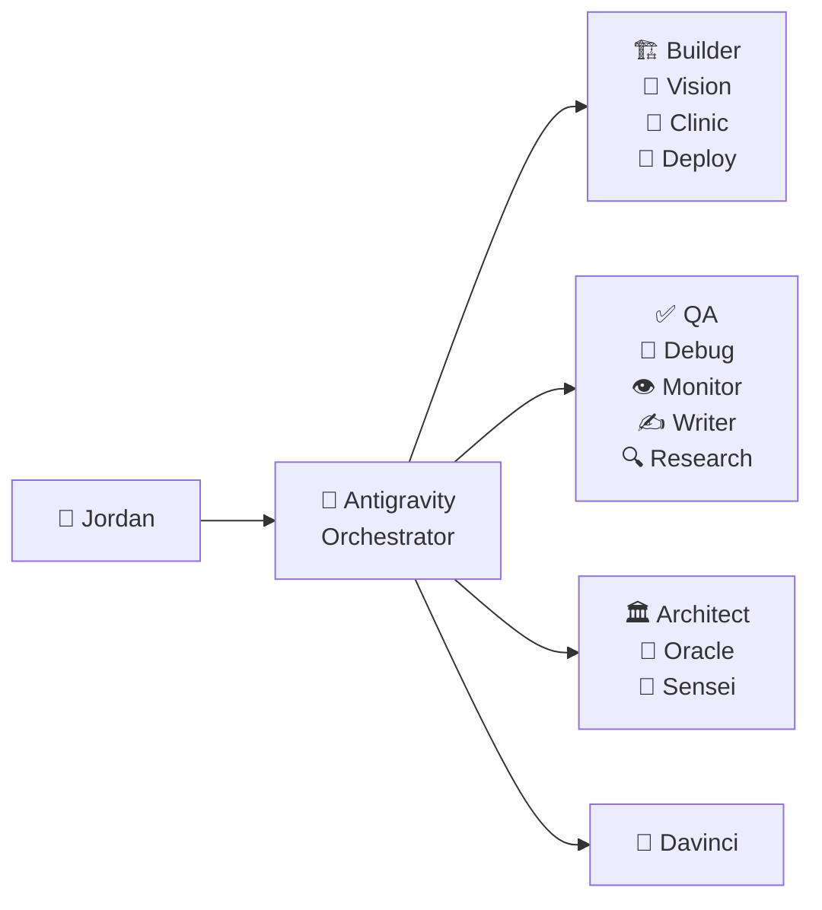

<div align="center">

<!-- HEADER ANIMÉ -->


<!-- BADGES STATUS -->
[](https://github.com/Drag0n69/Mycelium-AI-core)
[](https://github.com/Drag0n69)
[](https://cloud.google.com)

</div>

---

## 🔱 Qui suis-je ?

Je suis **Jordan Zerathe**, développeur et architecte IA basé en France 🇫🇷. Je construis **Mycelium OS** — un système d'exploitation cognitif orchestrant une ruche de **15 agents IA** spécialisés.

> *"L'intelligence n'est pas une chose unique. C'est un réseau."* — Principe fondateur de Mycelium

---

## 🍄 Mycelium OS — Le Projet Principal

<div align="center">

```
    __  ___                      _
   /  |/  /_  __________  ____  (_)_  ______ ___
  / /|_/ / / / / ___/ _ \/ / / / / / / / __ `__ \
 / /  / / /_/ / /__/  __/ / /_/ / / /_/ / / / / /
/_/  /_/\__, /\___/\___/_/\__,_/_/\__,_/_/ /_/ /_/
       /____/       O M E G A   E N G I N E
```

</div>

**Mycelium** est un OS d'IA modulaire avec :

| Module | Rôle | Techno |
|--------|------|--------|
| 🧠 **Core** | Runtime multi-agents | Bun + Fastify |
| ⚡ **Nexus** | Gateway WebSocket | Prisma + PGVector |
| 🎨 **Cockpit** | Interface de contrôle | Vue 3 + Tailwind v4 |
| 👁️ **Watchtower** | Monitoring & Sécurité | Node + Docker |

---

## 🛠️ Stack Technique

<div align="center">


</div>

---

## 🤖 La Ruche — 15 Agents Meta



---

## 📊 GitHub Stats

<div align="center">


</div>

<div align="center">

[](https://git.io/streak-stats)

</div>

---

## 🔗 Me Trouver

<div align="center">

[](https://github.com/Drag0n69)
[](https://github.com/Myxelium-Corp)
[](mailto:jordan.zerathe@gmail.com)

</div>

---

<div align="center">


*Mycelium OMEGA — Built with 🤍 by Jordan Zerathe* 🍄🛡️🚀

</div>
